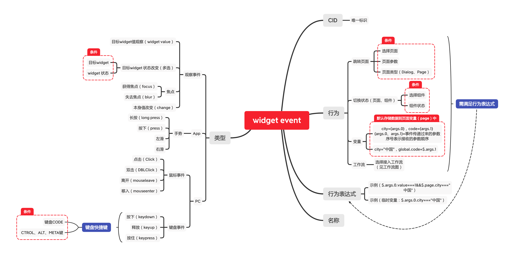

# 网页、App设计
##### 地址 [http://stulip.xicp.net:84](http://stulip.xicp.net:84)

##### App设计页面


### 安装步骤

#### 安装模块
```
yarn
```

1. 查看模式
```
yarn build -a
yarn start
```

2. 开发模式
```
yarn start design // design 为对应的模块名称
// 编译web模块为调试模式
yarn build:debug
// 或者换成开发模式
yarn start web
yarn start
```

3. 发布模式
```
yarn build:release
```

#### Widget事件驱动


#### Widget 工作流


##### 开发地址 [http://localhost:1235](http://localhost:1235)
